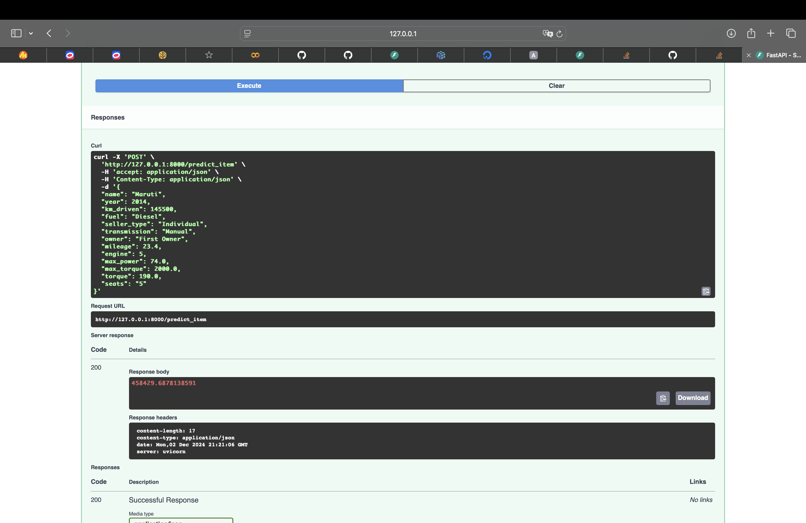
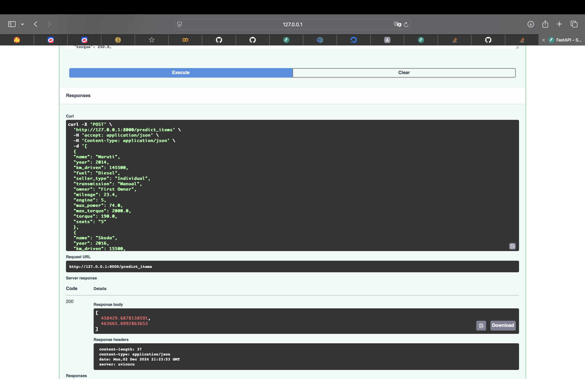

# Car_Price_Prediction

В рамках данной работы было сделано:

- Проанализирован датасет. Заполнены пропуски и удалены дубликаты
- Распарсили mileage, engine, max_power и torque, для того, чтобы получить чистый датасет.
- Проведен анализ связи между признаками, корреляция, проанализированы статистики. Реализована кастомная корреляция Спирмена
- Обучены и провалидированы модели LinearRegression, Lasso, ElasticNet только на вещественных признаках. Также реализованы метрики $R^2$ и $adjusted-R^2$. Улучшений по моделям в данном пункте ничего не давало. Не удалось реализовать модель с $L_0$-регуляризацией
- Через OHE закодированы категориальные признаки и добавлены к датасету. Обучена и провалидирована модель Ridge. Это дало наибольший буст в качестве.
- Реализованы бизнес метрики
- Реализован сервис для инференса на FastAPI

Скрины с примерами работа обоих методов сервиса:

